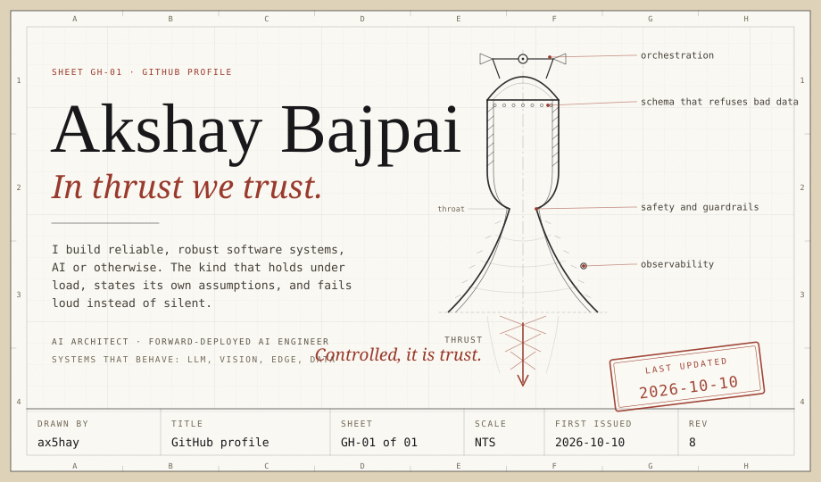
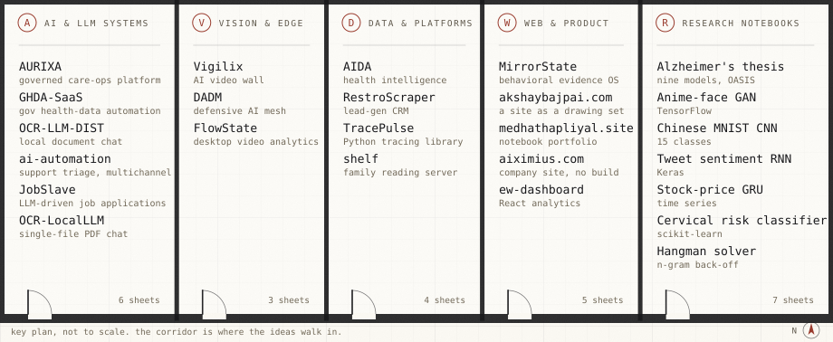
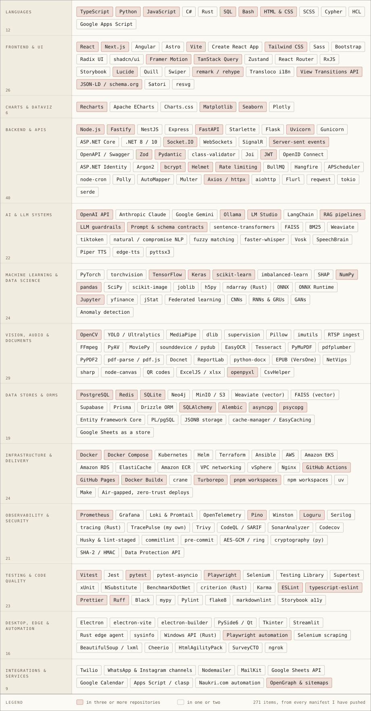
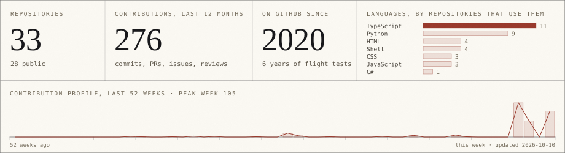
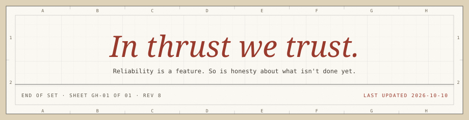

<picture>
  <source media="(prefers-color-scheme: dark)" srcset="assets/dark/hero.svg">
  
</picture>

  <a href="https://www.akshaybajpai.com"><b>akshaybajpai.com</b></a>
  &nbsp;&nbsp;·&nbsp;&nbsp;
  <a href="https://x.com/ax5hay"><b>@ax5hay</b></a>
  &nbsp;&nbsp;·&nbsp;&nbsp;
  <a href="mailto:contact@akshaybajpai.com"><b>contact@akshaybajpai.com</b></a>

Last updated <!-- updated:start -->10 October 2026<!-- updated:end -->. Every plate below is re-issued daily.

 

<picture>
  <source media="(prefers-color-scheme: dark)" srcset="assets/dark/h-notes.svg">
  
</picture>

1. **Thrust is cheap. Controlled thrust is the whole job.** I design systems the way you would design a propulsion stack. Shipping a demo is thrust. Keeping it upright in production is trust.
2. **Most of what I build sits in the unglamorous middle.** The orchestration, the safety layer, the schema that refuses bad data, the job queue that survives a restart.
3. **I gravitate toward AI systems that have to behave.** LLM assistance that stays inside guardrails, pipelines that turn mess into structured truth, and vision and edge workloads that run where the data actually lives.
4. **Everything here fails loud.** A system that states its own assumptions can be trusted with the ones it does not state.

 

<picture>
  <source media="(prefers-color-scheme: dark)" srcset="assets/dark/h-keyplan.svg">
  
</picture>

<picture>
  <source media="(prefers-color-scheme: dark)" srcset="assets/dark/keyplan.svg">
  
</picture>

 

<picture>
  <source media="(prefers-color-scheme: dark)" srcset="assets/dark/h-index.svg">
  
</picture>

<table>
<thead>
<tr><th align="left" width="72">Sheet</th><th align="left">Project</th><th align="left">What it is</th><th align="left">Built with</th></tr>
</thead>
<tbody>
<tr><td><code>A&#8209;01</code></td><td><a href="https://github.com/ax5hay/AURIXA"><b>AURIXA</b></a></td><td>Multi-tenant conversational care operations. Patients get calm self-service, staff get a shared workspace, platform teams get governed LLM assistance, all over one orchestration and safety layer.</td><td>TypeScript, Python, Next.js, Fastify, FastAPI, Postgres, Redis, Terraform, EKS</td></tr>
<tr><td><code>A&#8209;02</code></td><td><a href="https://github.com/ax5hay/GHDA-SaaS"><b>GHDA-SaaS</b></a></td><td>Government health-data automation. Turns messy, multilingual survey reports into structured JSON, gap analysis, and compliance insight.</td><td>Fastify gateway, FastAPI services, OCR, Postgres, MinIO, Prometheus</td></tr>
<tr><td><code>A&#8209;03</code></td><td><a href="https://github.com/ax5hay/OCR-LLM-DIST"><b>OCR-LLM-DIST</b></a></td><td>Document chat that never leaves the machine. OCR ingestion feeds local LLMs for streaming, grounded answers; swap Ollama and LM Studio freely.</td><td>FastAPI, Next.js, PyMuPDF, Streamlit, Docker</td></tr>
<tr><td><code>A&#8209;04</code></td><td><a href="https://github.com/ax5hay/ai-automation-main"><b>ai-automation</b></a></td><td>Support automation for a publisher. Classifies intent, runs hybrid semantic-plus-keyword RAG, and unifies identity across WhatsApp, Instagram, email, web, and SMS.</td><td>Node.js, Express, LangChain, Weaviate, Supabase, Twilio</td></tr>
<tr><td><code>A&#8209;05</code></td><td><a href="https://github.com/ax5hay/JobSlave"><b>JobSlave</b></a></td><td>Queue roles once; a local LLM answers screening questions while Playwright applies end to end. No cloud LLMs, no form grinding.</td><td>TypeScript, Electron, Playwright, Drizzle, LM Studio</td></tr>
<tr><td><code>A&#8209;06</code></td><td><a href="https://github.com/ax5hay/OCR-LocalLLM"><b>OCR-LocalLLM</b></a></td><td>The single-file version: read a PDF, ask a local model questions grounded in it.</td><td>Python, Streamlit, PyMuPDF</td></tr>
<tr><td><code>V&#8209;01</code></td><td><a href="https://github.com/ax5hay/Vigilix"><b>Vigilix</b></a></td><td>Live, AI-annotated multi-camera wall for security teams. RTSP ingest, YOLO overlays, incident alerts, patrol view, multi-tenant licensing.</td><td>React, Vite, FastAPI, Python vision worker, Postgres</td></tr>
<tr><td><code>V&#8209;02</code></td><td><a href="https://github.com/ax5hay/DADM-Aiximius"><b>DADM</b></a></td><td>Distributed AI defense mesh. On-device anomaly detection, encrypted federated updates, and a defense-ontology graph. Offline-first, zero-trust, air-gap capable.</td><td>Rust agent, Python, ONNX, Neo4j, Ansible</td></tr>
<tr><td><code>V&#8209;03</code></td><td><b>FlowState</b> private</td><td>Desktop video analytics and operator console with spoken alerts.</td><td>PySide6, OpenCV, YOLO, MediaPipe, PyTorch</td></tr>
<tr><td><code>D&#8209;01</code></td><td><a href="https://github.com/ax5hay/AIDA"><b>AIDA</b></a></td><td>Health-facility programme intelligence. Postgres to Prisma to NestJS to Next.js, with an LLM layer that only narrates numbers the API already computed.</td><td>TypeScript, NestJS, Prisma, Next.js, Recharts</td></tr>
<tr><td><code>D&#8209;02</code></td><td><a href="https://github.com/ax5hay/RestroScraper-PY"><b>RestroScraper</b></a></td><td>Lead-generation CRM. Scrapes business profiles, enriches and dedupes, tracks every lead through a pipeline with analytics and automation.</td><td>FastAPI, Next.js, Playwright, Selenium, SQLAlchemy, JSONB</td></tr>
<tr><td><code>D&#8209;03</code></td><td><a href="https://github.com/ax5hay/TracePulse"><b>TracePulse</b></a></td><td>One decorator for execution tracing in sync and async Python: timings, exceptions, structured logs, minimal overhead.</td><td>Python, Loguru</td></tr>
<tr><td><code>D&#8209;04</code></td><td><b>shelf</b> private</td><td>Offline-first family reading server, forked and reshaped.</td><td>C#, ASP.NET Core, EF Core, Angular, SQLite</td></tr>
<tr><td><code>W&#8209;01</code></td><td><a href="https://github.com/ax5hay/MirrorState"><b>MirrorState</b></a></td><td>A behavioral enforcement operating system built on quantified identity and operational evidence instead of self-report.</td><td>Next.js 15, React 19, Fastify, Prisma, BullMQ, Socket.IO, Turborepo</td></tr>
<tr><td><code>W&#8209;02</code></td><td><a href="https://github.com/ax5hay/akshaybajpai.com"><b>akshaybajpai.com</b></a></td><td>A personal site issued as numbered architectural sheets, re-issuable in three CSS-only states, with an x-ray lens over any part.</td><td>Next.js 15, static export, zero runtime 3D or animation deps</td></tr>
<tr><td><code>W&#8209;03</code></td><td><a href="https://github.com/ax5hay/medhathapliyal.site"><b>medhathapliyal.site</b></a></td><td>Notebook-style portfolio with page-turn transitions and full structured data.</td><td>Astro 5, View Transitions API, GitHub Pages</td></tr>
<tr><td><code>W&#8209;04</code></td><td><a href="https://github.com/ax5hay/aiximius.com"><b>aiximius.com</b></a></td><td>Company site written by hand. No framework, no build step.</td><td>HTML, CSS, GitHub Pages</td></tr>
<tr><td><code>W&#8209;05</code></td><td><a href="https://github.com/ax5hay/ew-dashboard"><b>ew-dashboard</b></a></td><td>React analytics dashboard with a Testing Library setup.</td><td>React, Recharts, Tailwind CSS</td></tr>
</tbody>
</table>

<b>R-01 to R-07</b> · research notebooks from earlier flight tests

 
<table>
<tbody>
<tr><td><code>R&#8209;01</code></td><td><a href="https://github.com/ax5hay/AlzheimersDiagnosis"><b>Alzheimer's thesis</b></a></td><td>Master's research: nine models benchmarked on OASIS clinical and neuroimaging biomarkers to classify dementia.</td></tr>
<tr><td><code>R&#8209;02</code></td><td><a href="https://github.com/ax5hay/GAN-Anime-Faces"><b>Anime-face GAN</b></a></td><td>A generator and discriminator trained against each other until the faces convince.</td></tr>
<tr><td><code>R&#8209;03</code></td><td><a href="https://github.com/ax5hay/CNN-Chinese-MNIST"><b>Chinese MNIST CNN</b></a></td><td>Fifteen handwritten numeral classes across fifteen thousand images.</td></tr>
<tr><td><code>R&#8209;04</code></td><td><a href="https://github.com/ax5hay/RNN_TheSocialDilemma"><b>Tweet sentiment RNN</b></a></td><td>Recurrent models compared side by side on documentary reactions.</td></tr>
<tr><td><code>R&#8209;05</code></td><td><a href="https://github.com/ax5hay/Stock-Market-Prediction-GRU"><b>Stock-price GRU</b></a></td><td>Stacked GRUs over windowed price history. Not financial advice.</td></tr>
<tr><td><code>R&#8209;06</code></td><td><a href="https://github.com/ax5hay/Cervical-Cancer-Classification"><b>Cervical risk classifier</b></a></td><td>Imbalanced clinical data, judged on precision, recall, and ROC-AUC rather than accuracy.</td></tr>
<tr><td><code>R&#8209;07</code></td><td><a href="https://github.com/ax5hay/Hangman_API_Optimisation_Problem"><b>Hangman solver</b></a></td><td>Pattern filtering over a 250k-word dictionary with n-gram back-off for words out of distribution.</td></tr>
</tbody>
</table>

 

<picture>
  <source media="(prefers-color-scheme: dark)" srcset="assets/dark/h-schedule.svg">
  
</picture>

<picture>
  <source media="(prefers-color-scheme: dark)" srcset="assets/dark/schedule.svg">
  
</picture>

The same schedule as text, for searching and copying

 

<!-- schedule:start -->
- **Languages.** TypeScript, Python, JavaScript, C#, Rust, SQL, Bash, HTML & CSS, SCSS, Cypher, HCL, Google Apps Script
- **Frontend & UI.** React, Next.js, Angular, Astro, Vite, Create React App, Tailwind CSS, Sass, Bootstrap, Radix UI, shadcn/ui, Framer Motion, TanStack Query, Zustand, React Router, RxJS, Storybook, Lucide, Quill, Swiper, remark / rehype, Transloco i18n, View Transitions API, JSON-LD / schema.org, Satori, resvg
- **Charts & dataviz.** Recharts, Apache ECharts, Charts.css, Matplotlib, Seaborn, Plotly
- **Backend & APIs.** Node.js, Fastify, NestJS, Express, FastAPI, Starlette, Flask, Uvicorn, Gunicorn, ASP.NET Core, .NET 8 / 10, Socket.IO, WebSockets, SignalR, Server-sent events, OpenAPI / Swagger, Zod, Pydantic, class-validator, Joi, JWT, OpenID Connect, ASP.NET Identity, Argon2, bcrypt, Helmet, Rate limiting, BullMQ, Hangfire, APScheduler, node-cron, Polly, AutoMapper, Multer, Axios / httpx, aiohttp, Flurl, reqwest, tokio, serde
- **AI & LLM systems.** OpenAI API, Anthropic Claude, Google Gemini, Ollama, LM Studio, LangChain, RAG pipelines, LLM guardrails, Prompt & schema contracts, sentence-transformers, FAISS, BM25, Weaviate, tiktoken, natural / compromise NLP, fuzzy matching, faster-whisper, Vosk, SpeechBrain, Piper TTS, edge-tts, pyttsx3
- **Machine learning & data science.** PyTorch, torchvision, TensorFlow, Keras, scikit-learn, imbalanced-learn, SHAP, NumPy, pandas, SciPy, scikit-image, joblib, h5py, ndarray (Rust), ONNX, ONNX Runtime, Jupyter, yfinance, jStat, Federated learning, CNNs, RNNs & GRUs, GANs, Anomaly detection
- **Vision, audio & documents.** OpenCV, YOLO / Ultralytics, MediaPipe, dlib, supervision, Pillow, imutils, RTSP ingest, FFmpeg, PyAV, MoviePy, sounddevice / pydub, EasyOCR, Tesseract, PyMuPDF, pdfplumber, PyPDF2, pdf-parse / pdf.js, Docnet, ReportLab, python-docx, EPUB (VersOne), NetVips, sharp, node-canvas, QR codes, ExcelJS / xlsx, openpyxl, CsvHelper
- **Data stores & ORMs.** PostgreSQL, Redis, SQLite, Neo4j, MinIO / S3, Weaviate (vector), FAISS (vector), Supabase, Prisma, Drizzle ORM, SQLAlchemy, Alembic, asyncpg, psycopg, Entity Framework Core, PL/pgSQL, JSONB storage, cache-manager / EasyCaching, Google Sheets as a store
- **Infrastructure & delivery.** Docker, Docker Compose, Kubernetes, Helm, Terraform, Ansible, AWS, Amazon EKS, Amazon RDS, ElastiCache, Amazon ECR, VPC networking, vSphere, Nginx, GitHub Actions, GitHub Pages, Docker Buildx, crane, Turborepo, pnpm workspaces, npm workspaces, uv, Make, Air-gapped, zero-trust deploys
- **Observability & security.** Prometheus, Grafana, Loki & Promtail, OpenTelemetry, Pino, Winston, Loguru, Serilog, tracing (Rust), TracePulse (my own), Trivy, CodeQL / SARIF, SonarAnalyzer, Codecov, Husky & lint-staged, commitlint, pre-commit, AES-GCM / ring, cryptography (py), SHA-2 / HMAC, Data Protection API
- **Testing & code quality.** Vitest, Jest, pytest, pytest-asyncio, Playwright, Selenium, Testing Library, Supertest, xUnit, NSubstitute, BenchmarkDotNet, criterion (Rust), Karma, ESLint, typescript-eslint, Prettier, Ruff, Black, mypy, Pylint, flake8, markdownlint, Storybook a11y
- **Desktop, edge & automation.** Electron, electron-vite, electron-builder, PySide6 / Qt, Tkinter, Streamlit, Rust edge agent, sysinfo, Windows API (Rust), Playwright automation, Selenium scraping, BeautifulSoup / lxml, Cheerio, HtmlAgilityPack, SurveyCTO, ngrok
- **Integrations & services.** Twilio, WhatsApp & Instagram channels, Nodemailer, MailKit, Google Sheets API, Google Calendar, Apps Script / clasp, Naukri.com automation, OpenGraph & sitemaps
<!-- schedule:end -->

 

<picture>
  <source media="(prefers-color-scheme: dark)" srcset="assets/dark/h-numbers.svg">
  
</picture>

<picture>
  <source media="(prefers-color-scheme: dark)" srcset="assets/dark/numbers.svg">
  
</picture>

Every plate on this page is drawn by <a href="scripts/render.py">one script</a> from the data in this repository, in the same type and ink as <a href="https://www.akshaybajpai.com">the site</a>, and re-issued daily by a GitHub Action. No third-party stat cards, no grades, no ranks.

 
 

<picture>
  <source media="(prefers-color-scheme: dark)" srcset="assets/dark/closing.svg">
  
</picture>
