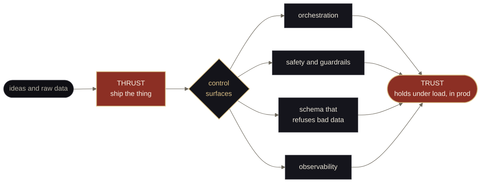
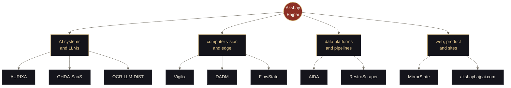

# Akshay Bajpai

**`In thrust we trust.`**

I build reliable, robust software systems, AI or otherwise. 
The kind that holds under load, states its own assumptions, and fails loud instead of silent.

---

<i>Thrust is cheap. Controlled thrust is the whole job.</i>

I design systems the way you'd design a propulsion stack: **thrust is easy, control is the work.**
Most of what I build sits in the unglamorous middle: the orchestration, the safety layer, the
schema that refuses bad data, the job queue that survives a restart. Shipping a demo is thrust.
Keeping it upright in production is trust.

I work across the stack but gravitate toward **AI systems that have to behave**: LLM assistance
that stays inside guardrails, pipelines that turn mess into structured truth, and vision/edge
workloads that run where the data actually lives.

---

## What I'm flying right now

A map of what I build, and the domains it falls into.

<table>
<tr>
<td width="50%" valign="top">

**[AURIXA](https://github.com/ax5hay/AURIXA)** · care-ops platform 
Multi-tenant conversational care operations: governed LLM assistance over one orchestration and safety layer. `TypeScript` · `Python` · `Next.js` · `FastAPI` · `Fastify`

</td>
<td width="50%" valign="top">

**[AIDA](https://github.com/ax5hay/AIDA)** · health intelligence 
Postgres → Prisma → NestJS → Next.js analytics with optional LLM narration. The UI never opens a DB connection. `TypeScript` · `Prisma`

</td>
</tr>
<tr>
<td width="50%" valign="top">

**[DADM](https://github.com/ax5hay/DADM-Aiximius)** · defensive AI mesh 
Edge anomaly detection, federated learning, defense-ontology graph. Offline-first, zero-trust, air-gap capable. `Rust` · `Python` · `ONNX` · `Neo4j`

</td>
<td width="50%" valign="top">

**[Vigilix](https://github.com/ax5hay/Vigilix)** · AI video wall 
Live multi-camera wall for security ops: RTSP ingest, YOLO overlays, incident alerts. `React` · `FastAPI` · `Python`

</td>
</tr>
<tr>
<td width="50%" valign="top">

**[GHDA](https://github.com/ax5hay/GHDA-SaaS)** · gov health automation 
Turns messy, multilingual survey reports into structured JSON, gap analysis, and compliance insight. `FastAPI` · `Fastify` · `OCR`

</td>
<td width="50%" valign="top">

**[akshaybajpai.com](https://github.com/ax5hay/akshaybajpai.com)** · this person, as a drawing set 
A personal site issued as numbered architectural sheets, re-issuable in three CSS-only states. `Next.js 15` · zero 3D runtime deps

</td>
</tr>
</table>

More in the <a href="https://github.com/ax5hay?tab=repositories">repository index</a>: lead CRMs, job-application automation, OCR and local-LLM document chat, a behavioral-evidence OS, and a pile of ML notebooks from earlier flight tests.

---

## The stack I actually touch

Every tool below appears in a shipped repo. Pulled by scanning every dependency manifest across all my repositories.

<table>
<tr>
<td valign="top"><b>Languages</b></td>
<td>

</td>
</tr>
<tr>
<td valign="top"><b>Frontend & UI</b></td>
<td>

</td>
</tr>
<tr>
<td valign="top"><b>Dataviz</b></td>
<td>

</td>
</tr>
<tr>
<td valign="top"><b>Backend & APIs</b></td>
<td>

</td>
</tr>
<tr>
<td valign="top"><b>AI, ML & data science</b></td>
<td>

</td>
</tr>
<tr>
<td valign="top"><b>Computer vision & docs</b></td>
<td>

</td>
</tr>
<tr>
<td valign="top"><b>LLMs, RAG & NLP</b></td>
<td>

</td>
</tr>
<tr>
<td valign="top"><b>Data & storage</b></td>
<td>

</td>
</tr>
<tr>
<td valign="top"><b>Infra, CI/CD & cloud</b></td>
<td>

</td>
</tr>
<tr>
<td valign="top"><b>Observability & security</b></td>
<td>

</td>
</tr>
<tr>
<td valign="top"><b>Testing & quality</b></td>
<td>

</td>
</tr>
<tr>
<td valign="top"><b>Desktop & integrations</b></td>
<td>

</td>
</tr>
</table>

---

## By the numbers

No rank grades, no vanity trophies: just what I build with and how much.

---

Reliability is a feature. So is honesty about what isn't done yet. 
<b>In thrust we trust.</b>

